## Project3 Documentation

For this personal project, I choose to continue explore NLP(natural language processing), specifically Word2Vec. 

My initial idea is to make a website where user enters a piece of text, and then the text will be parsed into words, a semantically closest color will be found to each word. Eventually the website will display a color palate, or some graphics/shaders made with the colors. I choose to working with first with Python as the backend.

#### For my first try, I deconstructed the process into following steps:

1. **Find an existing Word2Vec model** 

   The model I chose is a pre-trained model included in NLTK(natural language toolkit), which is part of a model that is trained on 100 billion words from the Google News Dataset. The full model is from https://code.google.com/p/word2vec/ (about 3 GB).

   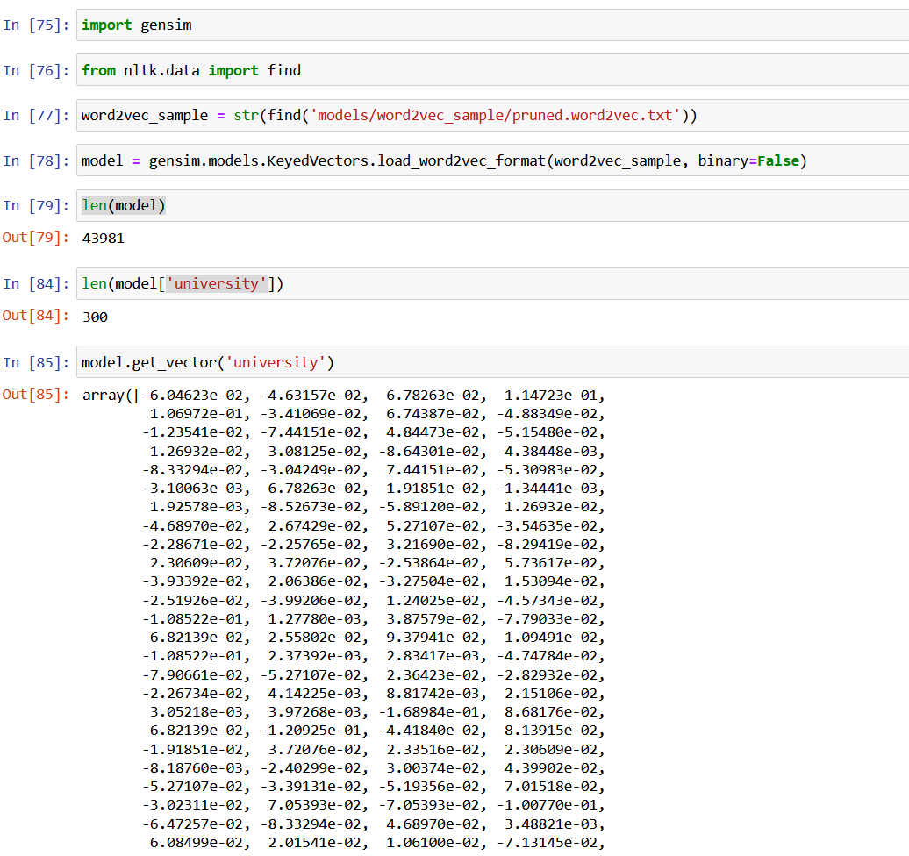

2. **User input text**

3. **Parse the text into words**

   For step 2 and 3, since I just started my experimentation, I chose to begin with using only one word as input, which is represented by the variable random_word.

   

4. **Convert the word to a vector using the Word2Vec model**

   As shown in step 1, the word 'university' is converted to a vector with a dimensionality of 300.

   

5. **Reduce dimensionality from 300 to 3**

   Referring to an example of [word embedding visualization](https://www.nltk.org/howto/gensim.html?highlight=word2vec), I used PCA first to reduce to ~50 dimensions, then using TSNE to further reduce to 2 dimensions. Since it is too time-consuming to reducing dimensionality for the entire model, I chose the first 1000 word to work on:

   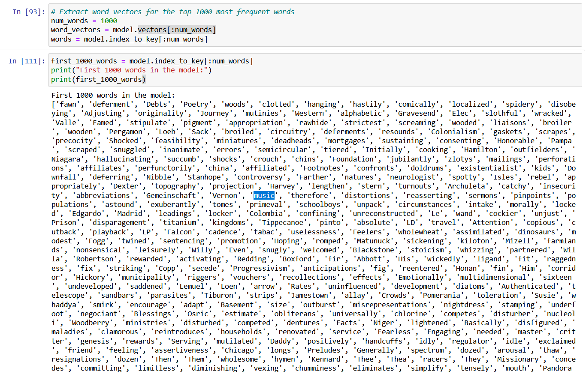

   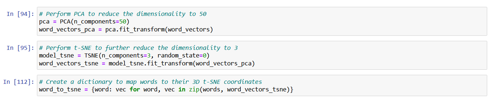

6. **Import RGB color data**

Referring to [Understanding Word Vectors by Allison Parrish](https://gist.github.com/aparrish/2f562e3737544cf29aaf1af30362f469), the RGB color data I chose is this [color data](https://github.com/dariusk/corpora/blob/master/data/colors/xkcd.json) from [xkcd color survey](https://blog.xkcd.com/2010/05/03/color-survey-results/).

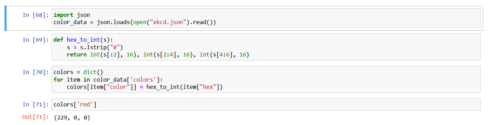

An RGB color space is defined by: Chromaticity coordinates of the red, green, and blue additive primaries. 

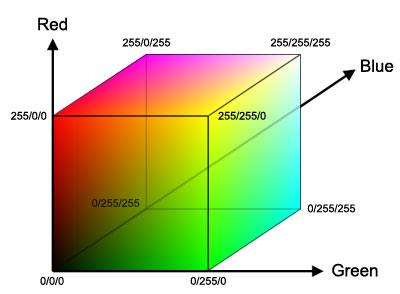

Therefore, the rgb coordinates can be viewed as vector in this RGB color space.

Referring to the same tutorial, I performed some color math based on vectors using Numpy.

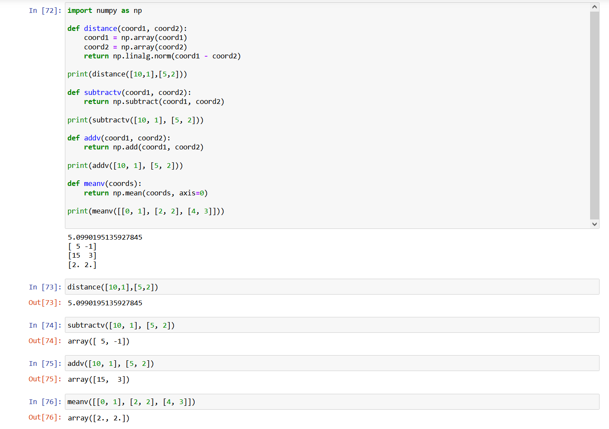

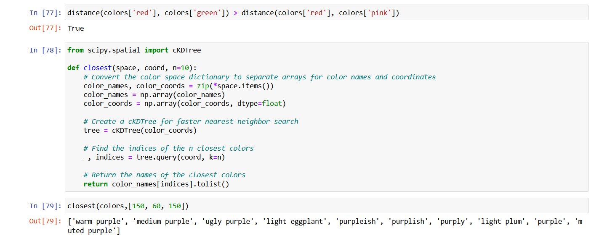

7. **Map the word vector to the RGB color space (normalize to range 0-255)**

Having both the color vector and the word vector in hand, I then decided to map the word vector to RGB color range so that they share the same spatial coordinates in the RGB color space.

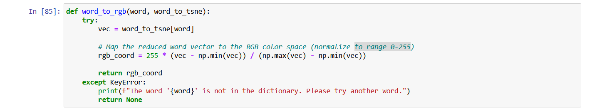

​		And here we go! At this point I'm able to enter an word and get the closest color to it. Here's 		what I got:

​		[The closest color to music is yellow orange.]

​		[The closest color to travel is greenish turquoise.]

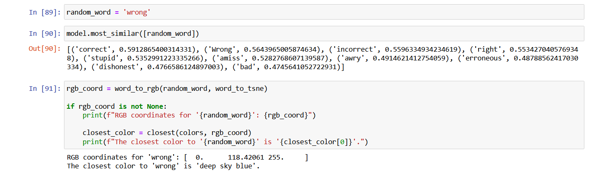

​		[The closest color to wrong is deep sky blue.]

------

At this point, although it seems everything is working, I can't help noticing some problems within the current structure I have:

1. Word2Vec is designed to capture the semantic relationships between words, and mapping the vectors to RGB space doesn't guarantee a meaningful connection to colors.

2. The Word2Vec model I used is limited to only first 1000 word to save time when reducing its dimensionality, however it also limits the input word  to 1000.

After talking to Adit, we come up with the next step iteration on the current structure:

Instead of normalize the word vector into RGB range, we define specific word analogy of primary colors as anchor points of red, green and blue (we call these three words "colorwords"), and calculate the distance of the input word to the colorwords. For example, the three colorwords that represent <u>red</u>, <u>blue</u> and <u>green</u> could be "<u>lava</u>", <u>"sky"</u> and <u>"grass"</u>. Let's say the input word is "book", then respectively calculate the distance between "book " and "<u>lava</u>", <u>"sky"</u> and <u>"grass"</u>, so that we get three numbers that represents similarity of "book" to each colorword. Then if we normalize the three numbers to the range 0-255, we got a new RGB vector that represent the word "book". Applying this approach could ideally skip the reducing dimensionality process, so that we don't have to reduce the Word2Vec model to only the first 1000 word.

------

#### For my second try, I first managed to modify my code according to Adit's feedback.

At this point, we first define three colorwords analogical to red, green and blue, then calculate the similarity the input word to each of the colorwords. Here, the three color words I define is [lava, grass, sky], and for the input word, I tried water, snake and love:

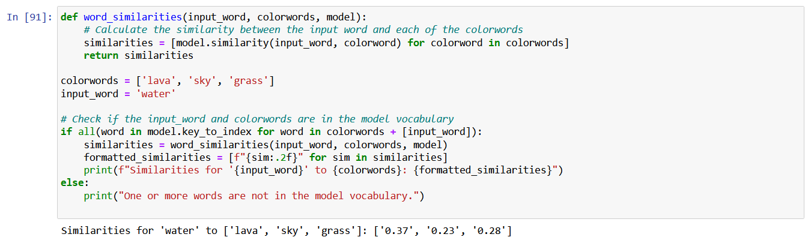

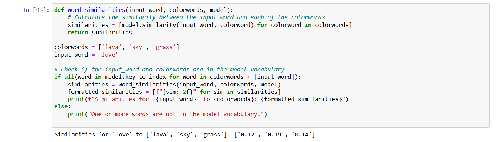

Then, I tried to map the similarities distance from -1 to 1 to 0 - 255 in order to normalize the similarities to RGB color range.

The first normalization method (method A) I used is to evenly map the similarities from -1 to 1 to 0 - 255, and find the closest color to the normalized similarities. However, a problem that this method post is that, once the input_word has the similar similarities to each colorwords, the closest color it finds it always a greyish one, because all the rgb numbers are almost even.

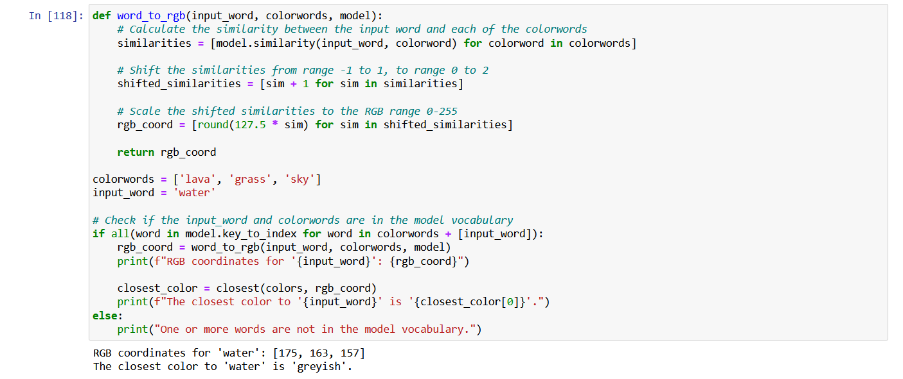

The second normalization method (method B) I tried is to map the highest similarity to 255 and the lowest similarity to 0, and the other similarity is mapped between 0 to 255. I soon realized that this method always returns a very bright color because the rgb coordinates are too extreme.

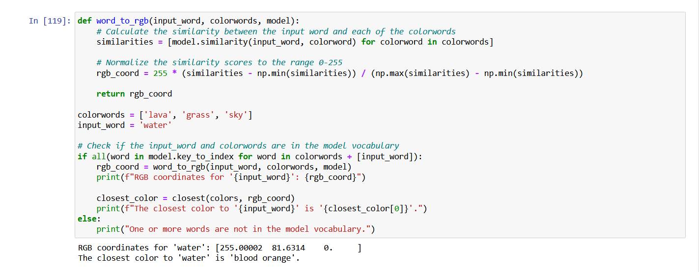

Then I realized that a more balanced color output is needed. To achieve this, I first tried to combine the two methods by bringing to an blending factor between 0 and 1, where 0 is fully method A and 1 is fully method B.

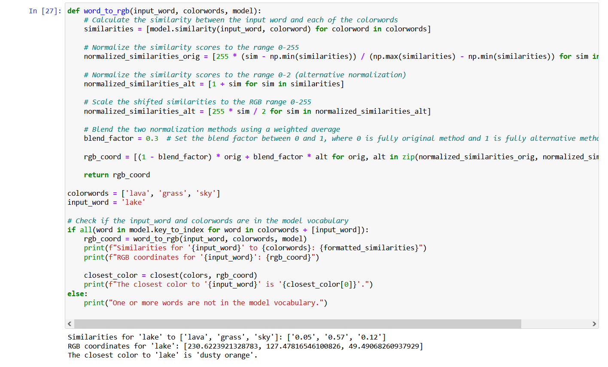

Another way I thought of to get a less extreme color is to get the color from a more moderate color range, therefore I decide to bring in a variable called range_divider between 0 and 0.5 that control the range of color for normalization. (0 is fully saturated and 0.5 is not saturated at all)

------

With the backend mostly finished, I decided to shift my focus to the design of the website. After consulting the instructors, I was suggested to run Flask on Replit, and write HTML and CSS as the front end of my website.

Below is a sketch I create for the design of my website. Ideally, the users first enters three analogous color words for red, green and blue, and a color space will be created accordingly using these three words as coordinate. Then, when user enters a piece of text, it will be traversed into words and the words will be mapped into this color space according to their semantic distance to each color word, representing their spatial relationship with each other.

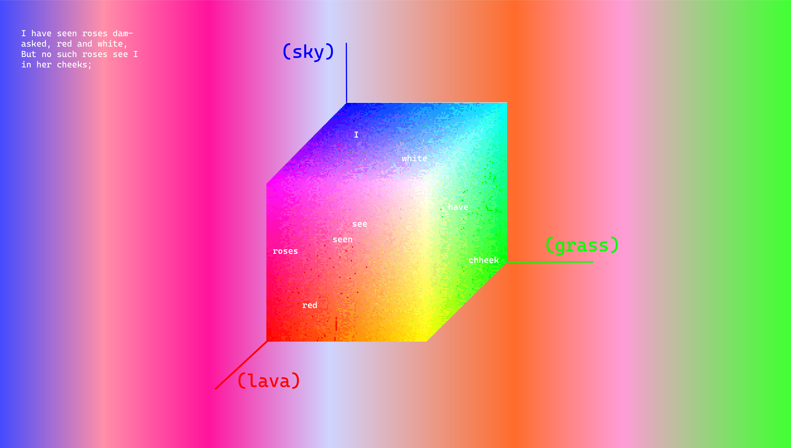

Below is my first iteration of the interface. Upon the input of the word "lake" and the color words "sun, grass and sky"， it will return a RGB coordinate of the word "lake", and the background color will turn to that color

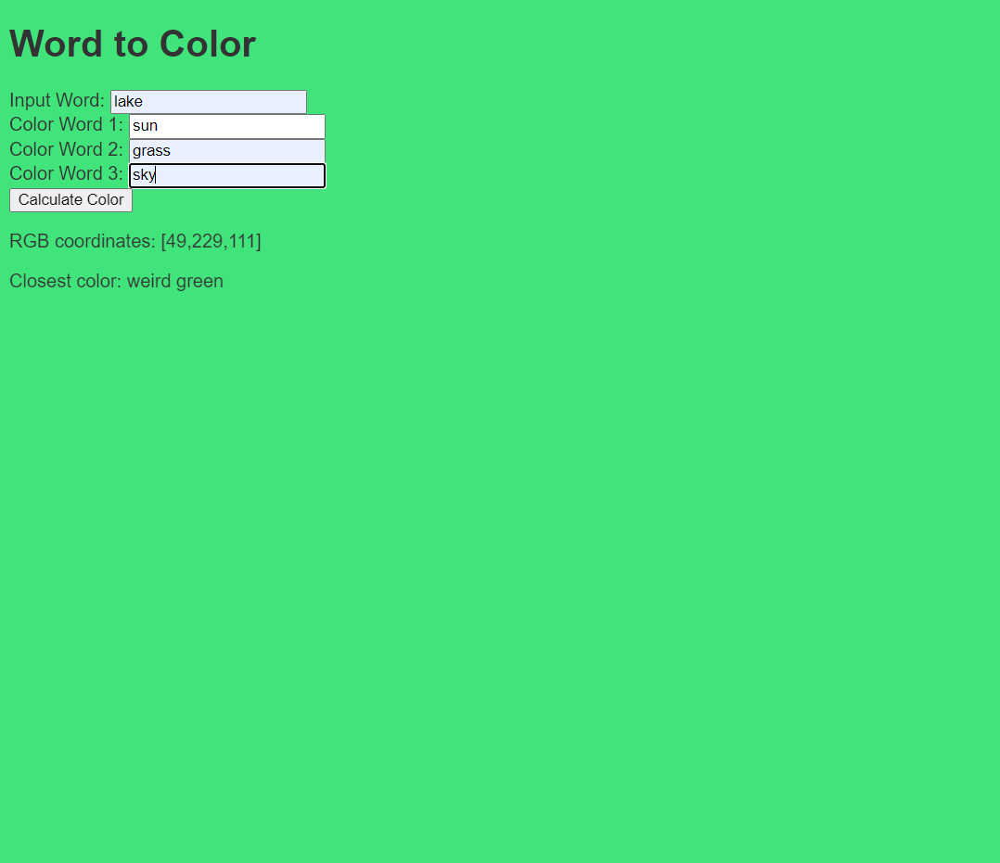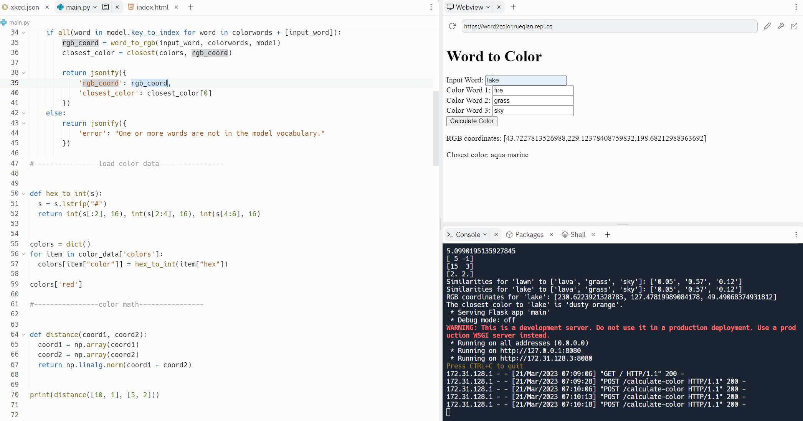

Next I worked on the traverse of text, and managed to output a list of RGB coordinate for the input text. The background will turn to a gradient composed by the list of colors.

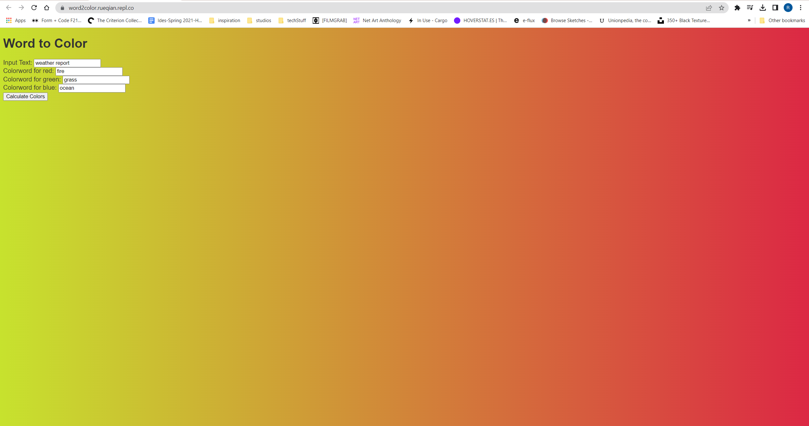

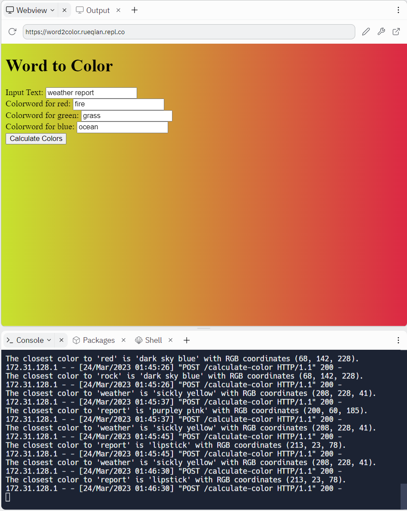

Bringing in a real-time spatial mapping of the words into the color space turned to be a really difficult task at first. I was thinking of using a 3D cube mode and positioning the word within the model space, but I didn't figured out how to achieve it. 

Then I talked to Yixin and she suggested me to map it on a 2D surface instead of in a 3D model, which could be achieved using P5.js.

In P5.js, I first upload a hexagon to represent the RGB space, and the label of RGB will changed according to the user's own definition of the RGB colors.

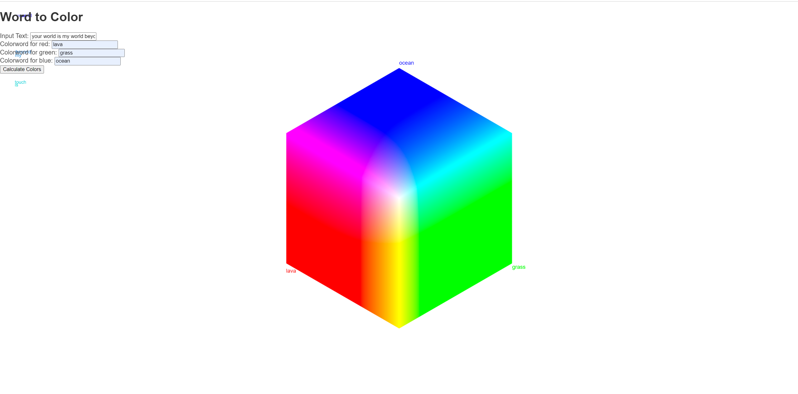

Then I uses the function below to convert the RGB coordinates of the traversed input text into a (x, y) position within the hexagon.

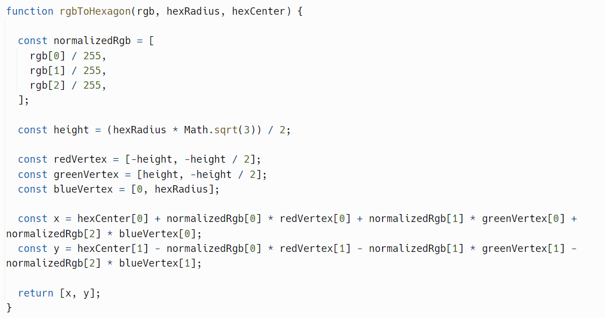

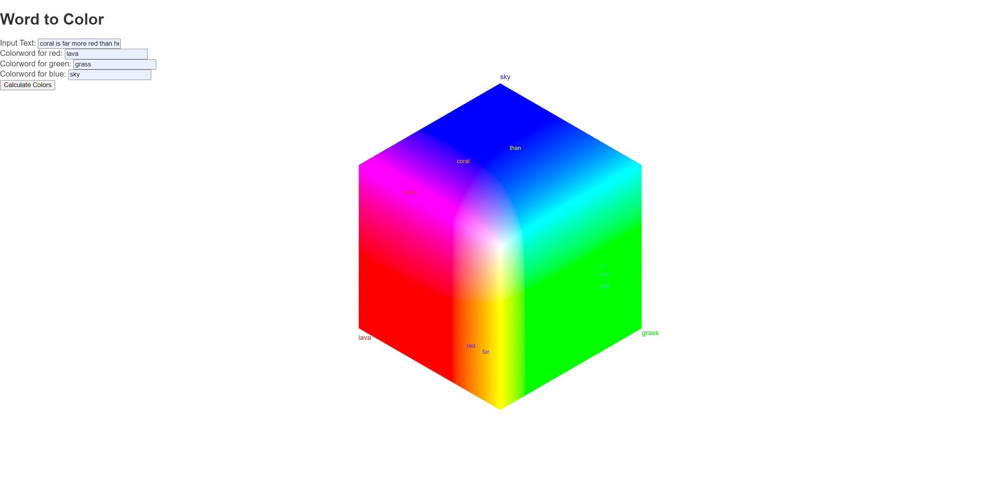

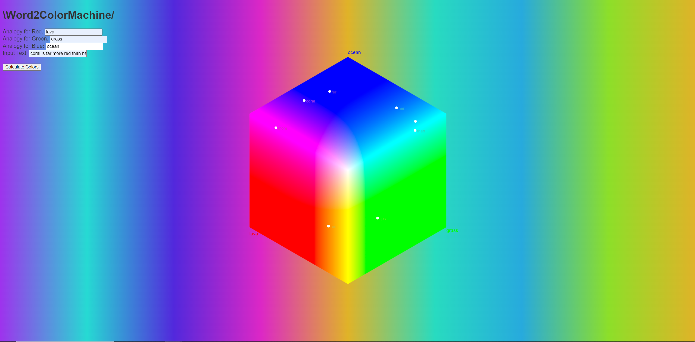

Then I added a z-index to the sketch.js and layered it over the html I had before, so that the gradient is also present in the background. And that's pretty much how I finished this project, here's the published link to my replit: https://replit.com/@RueQian/word2colorP5js?v=1
